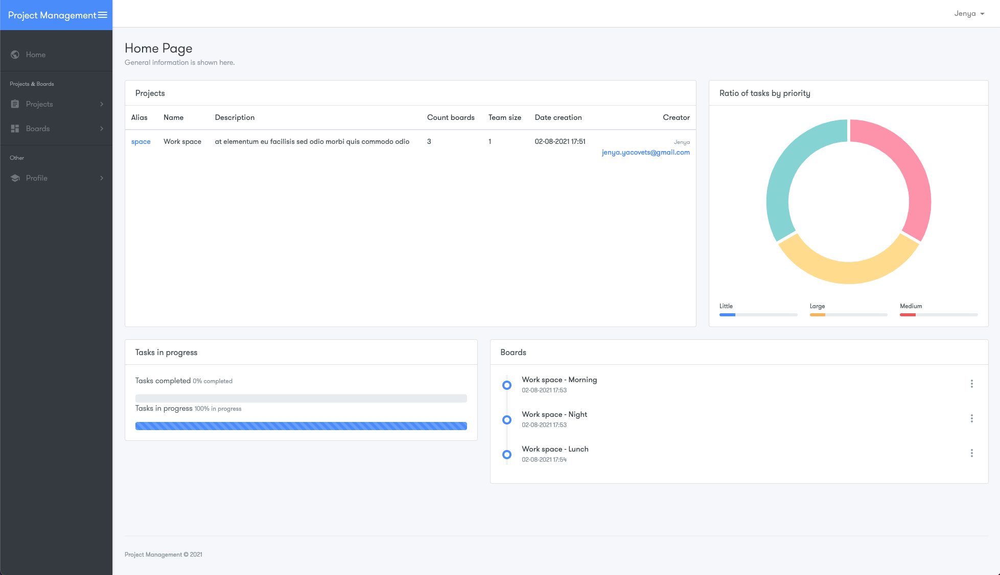
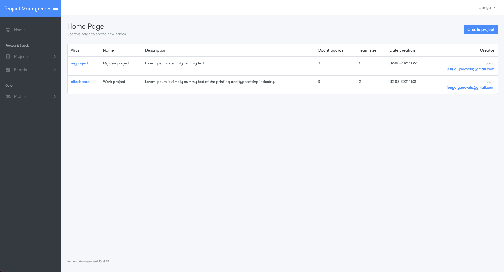
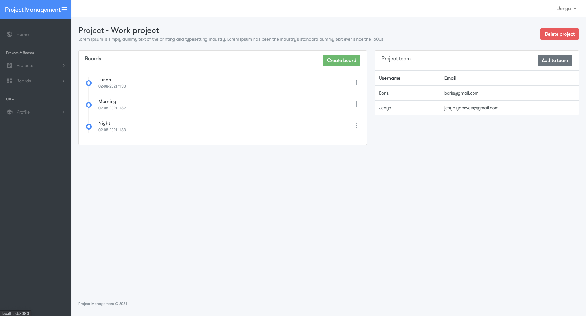
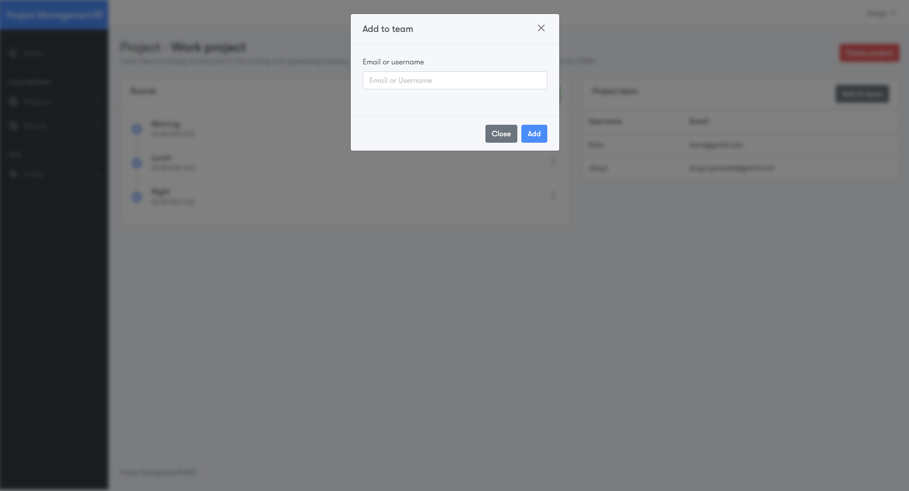
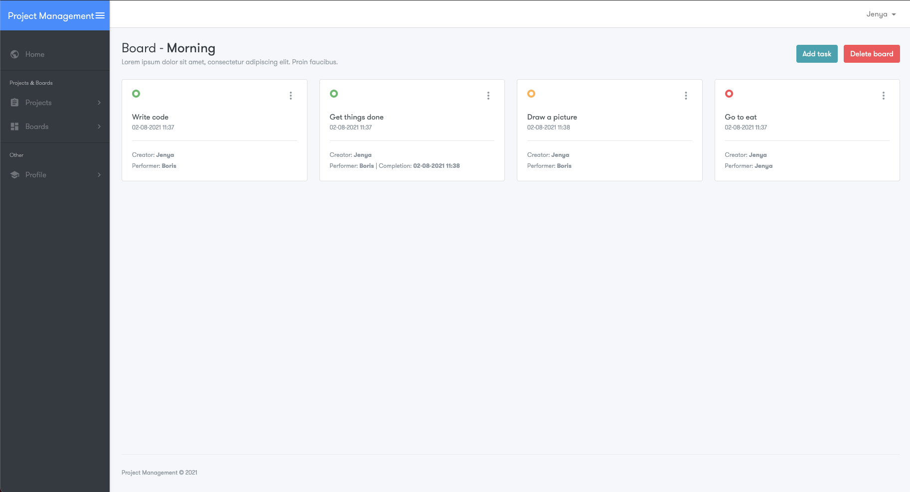
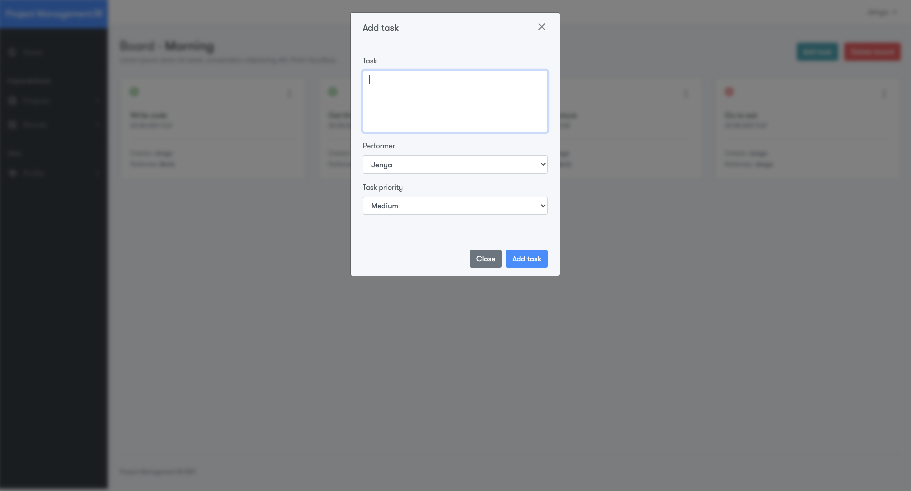
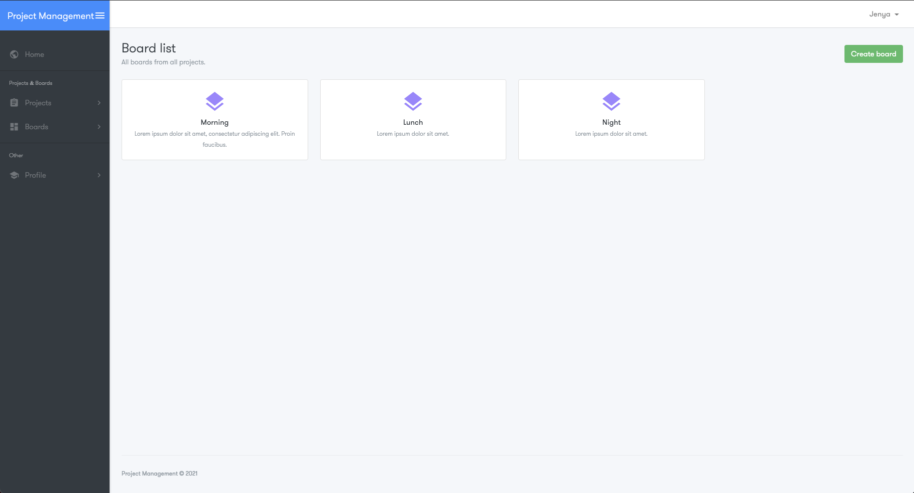
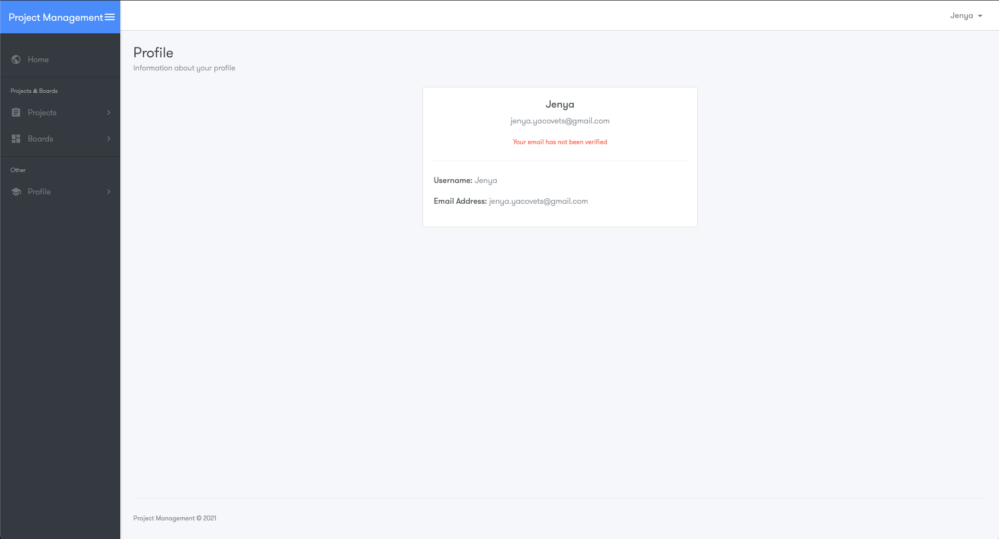

# Project management

### Description: A Java application for working in a team. You can create projects, invite other registered users to projects. In the project, you can create many boards for different directions. In the boards, you can add tasks, select performer and set the importance of the task. When adding to a team or task, the user receives an email.

### Demo
#### Home:

#### Registration page:

#### Project list:

#### Project:

#### Add to team:

#### Board:

#### Add task:

#### Board list:

#### User profile:


### Technologies:
- Java EE 11
- Maven
- Spring data JPA
- Spring Boot:
    + Spring MVC
    + Spring security
    + Spring test
    + Spring validation
- Thymeleaf
- Docker
- H2

### Creating a Dockers Image

1. #### Package a Java application
```console
root@localhost:~$ mvn package
```
2. #### Building the image locally
```console
root@localhost:~$ docker build -t project-management .
```

3. #### Run the container
```console
root@localhost:~$ docker run -d -p 8080:8080 project-management
```

